<div align="center">

# 🎯 Unknown Auction

### ⚡ 실시간 경매 플랫폼

[](https://reactjs.org/)
[](https://www.typescriptlang.org/)
[](https://vitejs.dev/)
[](https://tailwindcss.com/)

<br/>

### 📦 프로젝트 저장소

<table>
  <tr>
    <td align="center" width="50%">
      <a href="https://github.com/devaspirant0510/UnknownAuction-Front">
        
      </a>
      <br/>
      <sub><b>🎨 프론트엔드 저장소</b></sub>
      <br/>
      <sub>React + TypeScript + Vite</sub>
    </td>
    <td align="center" width="50%">
      <a href="https://github.com/devaspirant0510/UnknownAuction-Server">
        
      </a>
      <br/>
      <sub><b>⚙️ 백엔드 저장소</b></sub>
      <br/>
      <sub>Spring Boot + WebSocket</sub>
    </td>
  </tr>
</table>

</div>

---

## 📋 목차

- [프로젝트 저장소](#-프로젝트-저장소)
- [기술 스택](#-기술-스택)
- [환경 변수 설정](#-환경-변수-설정)
- [프론트엔드 아키텍처](#-프론트엔드-아키텍처)
- [Git 협업 방식](#-git-협업-방식)

---

## 🛠 기술 스택

### Core
| 기술 | 설명        | 버전   |
|------|-----------|------|
| ⚛️ **React** | SPA 라이브러리 | 19.x |
| 📘 **TypeScript** | 정적 타입 지원  | 5.x  |
| ⚡ **Vite** | 빌드 툴      | 5.x  |

### State Management & Data Fetching
| 기술 | 설명                      |
|------|-------------------------|
| 🔄 **React Query** | fetching & caching 상태 관리 |
| 🐻 **Zustand** | 전역 상태 관리                |
| 📡 **Axios** | HTTP 클라이언트              |
| 🔌 **WebSocket (STOMP)** | 실시간 통신                  |

### UI & Styling
| 기술 | 설명 |
|------|------|
| 🎨 **TailwindCSS** | 유틸리티 CSS 프레임워크 |
| 🧩 **shadcn/ui** | UI 컴포넌트 라이브러리 |

### Additional
| 기술 | 설명 |
|------|------|
| 🔥 **Firebase** | 푸시 알림 (FCM) |

---

## ⚙️ 환경 변수 설정

프로젝트 루트에 `.env` 파일을 생성하고 아래 변수들을 설정하세요.

### 🔧 기본 설정
```env
# 환경 모드 (development | production)
VITE_MODE=development

# 서버 URL
VITE_SERVER_URL=https://your-backend-api.com

# 프론트엔드 URL
VITE_FRONT_URL=https://your-frontend-url.com
```

### 🔐 OAuth & 소셜 로그인
```env
# Kakao Web Key
VITE_KAKAO_API_KEY=your_kakao_web_key
```

### 🔥 Firebase 설정
```env
VITE_FIREBASE_API_KEY=your_firebase_api_key
VITE_FIREBASE_AUTH_DOMAIN=your_firebase_auth_domain
VITE_FIREBASE_PROJECT_ID=your_firebase_project_id
VITE_FIREBASE_STORAGE_BUCKET=your_firebase_storage_bucket
VITE_FIREBASE_MESSAGING_SENDER_ID=your_firebase_messaging_sender_id
VITE_FIREBASE_APP_ID=your_firebase_app_id
VITE_FIREBASE_MEASUREMENT_ID=your_firebase_measurement_id
VITE_FIREBASE_VAPID_KEY=your_firebase_vapid_key
```


---

## 🏗 프론트엔드 아키텍처

**Feature-Sliced Design (FSD)** 아키텍처를 따릅니다.

### 📊 레이어 구조

```
┌─────────────────────────────────────────┐
│              📄 Pages                   │  최종 페이지 조합
├─────────────────────────────────────────┤
│              🧱 Widgets                 │  UI 블록 조합
├─────────────────────────────────────────┤
│              🧰 Features                │  비즈니스 기능
├─────────────────────────────────────────┤
│              🧩 Entities                │  비즈니스 엔티티
├─────────────────────────────────────────┤
│              🔧 Shared                  │  공통 코드
└─────────────────────────────────────────┘
```

### 레이어별 상세 설명

<details>
<summary><strong>📄 Pages</strong> - 완성된 페이지</summary>

| 세그먼트 | 설명 | 예시 |
|---------|------|------|
| **ui** | 페이지 조합 | HomePage, ProfilePage |
| **lib** | 페이지 기능 | usePageScroll |
| **api** | 데이터 로더 | SSR 프레임워크용 |

</details>

<details>
<summary><strong>🧩 Entities</strong> - 비즈니스 개체 정의 및 관련 로직</summary>

| 세그먼트 | 설명 | 예시 |
|---------|------|------|
| **ui** | 엔티티 UI 컴포넌트 | UserCard, ProductCard |
| **model** | 상태 및 데이터 조작 | userStore |
| **lib** | 계산 로직 | calculateDiscount |
| **api** | 엔티티 관련 API | getUserById, updateUser |

</details>

<details>
<summary><strong>🧰 Features</strong> - 실제 사용자 기능 단위</summary>

| 세그먼트 | 설명 | 예시 |
|---------|------|------|
| **ui** | 상호작용 UI | LikeButton, FollowButton |
| **model** | 비즈니스 로직 | toggleLike, changeTheme |
| **lib** | 보조 로직 | validateInput |
| **api** | 기능 관련 API | likePost, followUser |

</details>

<details>
<summary><strong>🧱 Widgets</strong> - UI 조각 조합</summary>

| 세그먼트 | 설명 | 예시 |
|---------|------|------|
| **ui** | 복합 UI 블록 | PostList, CommentSection |
| **lib** | 상호작용 처리 | useSwipeGesture |
| **model** | 인프라 스토어 | 로직 없이 저장소만 |

</details>

<details>
<summary><strong>📄 Pages</strong> - 완성된 페이지</summary>

| 세그먼트 | 설명 | 예시 |
|---------|------|------|
| **ui** | 페이지 조합 | HomePage, ProfilePage |
| **lib** | 페이지 기능 | usePageScroll |
| **api** | 데이터 로더 | SSR 프레임워크용 |

</details>

---

## 📌 Git 협업 방식

### 🌳 Git Flow 전략


#### 브랜치 전략

| 브랜치 | 용도 | 네이밍 규칙 | 설명 |
|--------|------|-------------|------|
| 🚀 **main** | 프로덕션 | `main` | 현재 운영 중인 서비스 |
| 🎁 **release** | 배포 준비 | `release-1.0.0` | 버전별 배포 관리 |
| 🚨 **hotfix** | 긴급 수정 | `hotfix/1.0.1-이슈명` | 프로덕션 긴급 버그 수정 |
| 🔧 **develop** | 개발 | `dev` | 개발 중인 최신 코드 |
| ✨ **feature** | 기능 개발 | `feature/기능명` | 새로운 기능 개발 |

### 📝 커밋 컨벤션

| Prefix | 설명 | 예시 |
|--------|------|------|
| ✨ **feat** | 새로운 기능 추가 | `feat: 실시간 채팅 기능 구현` |
| 🐛 **fix** | 버그 수정 | `fix: 로그인 토큰 만료 처리 수정` |
| 📝 **docs** | 문서 수정 | `docs: README 업데이트` |
| 💄 **style** | 코드 포맷팅 | `style: 세미콜론 추가` |
| ♻️ **refactor** | 코드 리팩토링 | `refactor: API 호출 로직 개선` |
| ✅ **test** | 테스트 코드 | `test: 유저 서비스 테스트 추가` |
| 🔧 **chore** | 빌드/설정 | `chore: package.json 업데이트` |

#### 커밋 메시지 작성 예시
```bash
feat: 실시간 경매 입찰 기능 구현

- WebSocket STOMP 연결 추가
- 입찰 UI 컴포넌트 작성
- 입찰 히스토리 조회 API 연동
```

---

## 🏛 프로젝트 구조

이 프로젝트는 **프론트엔드**와 **백엔드**로 구성된 풀스택 애플리케이션입니다.

```mermaid
graph TB
    subgraph "🎨 Frontend"
        A[React + TypeScript]
        B[WebSocket Client]
        C[React Query]
    end
    
    subgraph "⚙️ Backend"
        D[Spring Boot]
        E[WebSocket Server]
        F[Database]
    end
    
    A -->|HTTP/REST API| D
    B -->|WebSocket/STOMP| E
    C -->|Data Fetching| D
    E -->|Real-time Updates| B
    D -->|Query/Update| F
    
    style A fill:#61DAFB
    style D fill:#6DB33F
```



### 📚 관련 저장소

| 저장소 | 설명 | 기술 스택 | 링크 |
|--------|------|-----------|------|
| 🎨 **Frontend** | 사용자 인터페이스 | React, TypeScript, Vite, TailwindCSS | [바로가기](https://github.com/devaspirant0510/UnknownAuction-Front) |
| ⚙️ **Backend** | API 서버 및 비즈니스 로직 | Spring Boot, WebSocket, JPA | [바로가기](https://github.com/devaspirant0510/UnknownAuction-Server) |

> 💡 **Tip**: 전체 프로젝트를 실행하려면 백엔드와 프론트엔드 저장소를 모두 클론하고 실행해야 합니다.

---

<div align="center">

### 🎉 Happy Coding! 🎉

**Made with ❤️ by Unknown Auction Team**

<br/>

[](https://github.com/devaspirant0510/UnknownAuction-Front)
[](https://github.com/devaspirant0510/UnknownAuction-Server)

</div>

